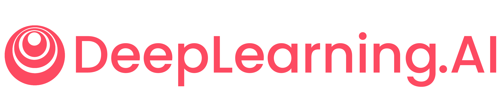

# **Machine Learning Specialization by DeepLearning.AI and Stanford University**  

  
  &nbsp;&nbsp;&nbsp;&nbsp;
  

This repository showcases my completed projects and coursework from the **Machine Learning Specialization**, a collaboration between **DeepLearning.AI** and **Stanford University**. Through this specialization, I’ve gained hands-on experience in building and deploying machine learning models using industry-standard tools and techniques.  

## **Course Highlights**  

### **Course 1: Supervised Machine Learning - Regression and Classification**  
- Built machine learning models in Python using popular libraries like **NumPy** and **scikit-learn**.  
- Developed and trained supervised models for **prediction** and **binary classification tasks**, including **linear regression** and **logistic regression**.  

### **Course 2: Advanced Learning Algorithms**  
- Built and trained **neural networks** with **TensorFlow** to perform **multi-class classification**.  
- Applied best practices for machine learning development to ensure models generalize well to real-world data and tasks.  
- Implemented **decision trees** and **tree ensemble methods**, including **random forests** and **boosted trees**.  

### **Course 3: Unsupervised Learning, Recommenders, Reinforcement Learning**  
- Used **unsupervised learning techniques** such as **clustering** and **anomaly detection**.  
- Built **recommender systems** using **collaborative filtering** and **content-based deep learning methods**.  
- Developed a **deep reinforcement learning model** for advanced applications.  

## **Certification**  
  
*Click the badge to verify my certification.*  

## **Disclaimer**  
This repository contains code and projects completed as part of the **Machine Learning Specialization** by **DeepLearning.AI** and **Stanford University** on Coursera. The code is provided for **educational and reference purposes only**.  

- Do not copy and submit this code as your own for Coursera assignments or any other purpose.  
- If you are taking the same course, I encourage you to solve the assignments on your own to maximize your learning. 
